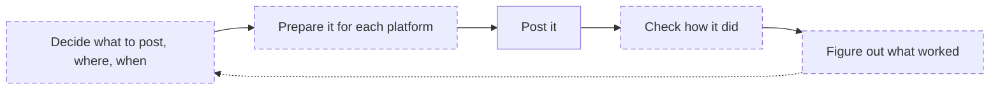

# Planzoid (working name)

This is a plan, not a product. There is no code yet.

## Why this exists

I'm a solo builder. I've built three apps, and I've failed to get any of them
seen. Building is the part I can do. Everything after that, I keep losing
track of: what I posted where, which community allows self-promotion, whether
any post actually worked, and what to try next.

This is the loop I keep failing at. The dashed steps are where I get lost:

The tools I've found mostly help with "Post it." The ones that help with the
rest are paid and seem made for brand accounts. Maybe I've missed something.

## What I'm thinking of building

A free, local, open-source app that helps one person through the whole loop:
a calendar for the plan, checks before each post, posting by hand, a place to
record results, and a way to see what worked. It would work without AI, with
AI as an optional extra.

## What I don't know yet

- Whether other people have this problem, or it's just me
- Whether something already solves it and I haven't found it
- Whether the plan in `docs/` is too big for what's needed

## How you can help

Tell me how you handle this today, what's wrong with the plan, or that I
shouldn't build it at all. Open an issue or start a discussion. If nobody
needs it, it won't be built.

## The plan (drafts)

| | |
|---|---|
| What it would do | [docs/PRODUCT.md](docs/PRODUCT.md) |
| How it would be built | [docs/ARCHITECTURE.md](docs/ARCHITECTURE.md) |
| Data it would store | [docs/DATA_MODEL.md](docs/DATA_MODEL.md) |
| Platform support | [docs/PLATFORMS.md](docs/PLATFORMS.md) |
| Design rules | [docs/DESIGN.md](docs/DESIGN.md) |
| Rough roadmap | [docs/ROADMAP.md](docs/ROADMAP.md) |

## Licence

[Apache-2.0](LICENSE)
